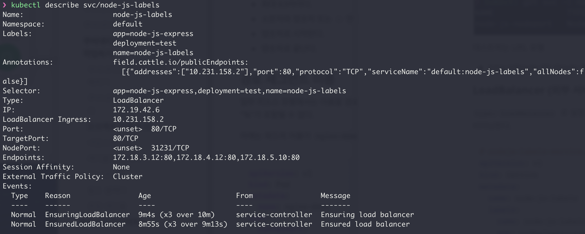
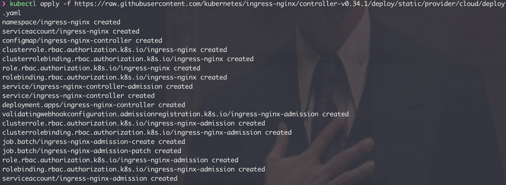
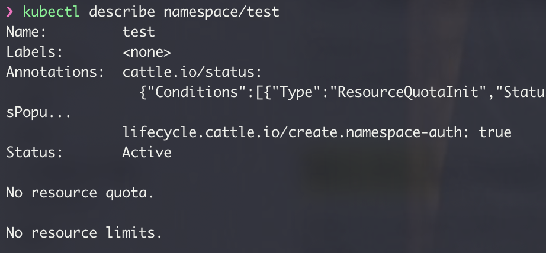
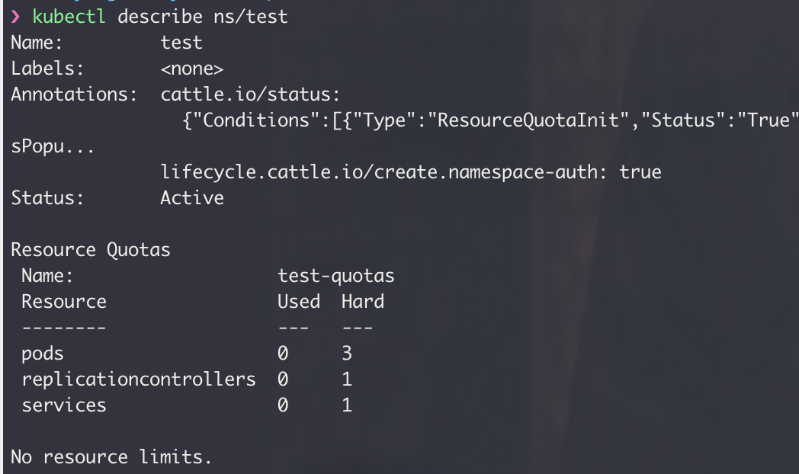

# K8s - 네트워킹, 로드 밸런서, 인그레스

쿠버네티스 네트워킹은 다음의 네 가지 문제를 해결한다.

1. 파드 내의 컨테이너는 루프백(loopback)을 통한 네트워킹을 사용하여 통신한다.
2. 클러스터 네트워킹은 서로 다른 파드 간의 통신을 제공한다.
3. 서비스 리소스를 사용하면 파드에서 실행 중인 애플리케이션을 클러스터 외부에서 접근할 수 있다.
4. 또한 서비스를 사용하여 클러스터 내부에서 사용할 수 있는 서비스만 게시할 수 있다.

## 쿠버네티스의 네트워킹 방식

- 컨테이너가 아닌 파드에 IP 주소 공간을 할당해 컨테이너 간의 통신을 분리한다.
- 쿠버네티스 네트워킹 모델의 주요 통신 패러다임은 파드 간의 통신 및 서비스
- 서비스 객체를 사용해 파드와 서비스, 파드와 외부 서비스 간에 통신

## 서비스

- 파드 집합에서 실행중인 애플리케이션을 네트워크 서비스로 노출하는 추상화 방법. 파드와 비슷한 REST 오브젝이다. 
- 모든 REST 오브젝트와 마찬가지로, 서비스의 정의는 API 서버에 `POST` 하여 새 인스턴스를 생성할 수 있다. 
- 서비스 오브젝트의 이름은 유효한 DNS 서브도메인 이름

### 가상 IP 와 서비스 프록시

쿠버네티스 클러스터의 모든 노드는 `kube-proxy` 를 실행한다. `kube-proxy` 는 서비스에 대한 가상 IP 형식을 구현한다.

**서비스에 프록시를 사용하는 이유**

라운드-로빈 DNS 사용하지 않고 프록시를 사용하는 데는 몇 가지 이유가 있다.

- 레코드 TTL을 고려하지 않고, 만료된 이름 검색 결과를 캐싱하는 DNS 구현에 대한 오래된 역사
- 일부 앱의 경우 DNS 검색을 한 번만 수행하고 결과를 무기한 캐시
- DNS 레코드의 TTL이 낮거나 0이면 DNS에 부하가 높아 관리하기 어렵다


### 다양한 `kube-proxy` 모드

#### User space 프록시 모드


kube-proxy는 쿠버네티스 마스터의 서비스, 엔트포인트 오브젝트의 추가와 제거를 감시

- 각 서비스는 로컬 노드에서 포드를 연다. 이 프록시 포트에 대한 모든 연결은 서비스의 백엔드 파드중 하나로 프록시 된다. 
- userspace 프록스는 서비스의 clusterIP 와 port에 대한 트래픽을 캡처하는 iptables 규칙을 설치한다. 이 규칙은 트래픽을 백엔드 파드를 프록시하는 프록시 포트로 리다이렉션한다.
- 기본적으로, 유저스페이스 모드의 kube-proxy는 라운드-로빈 알고리즘으로 백엔드를 선택한다.


#### iptables 프록시 모드


kube-proxy는 쿠버네티스 컨트롤 플레인의 서비스, 엔드포인트 오브젝트의 추가와 제거를 감시

- 각 서비스에 대해, 서비스의 `clusterIP` 및 `port`에 대한 트래픽을 캡처하고 해당 트래픽을 서비스의 백엔드 세트 중 하나로 리다이렉트하는 iptables 규칙을 설치한다.
- 기본적으로, iptables 모드의 kube-proxy는 임의의 백엔드를 선택한다.
- 트래픽을 처리하기 위해 iptables를 사용하면 시스템 오버헤드가 줄어드는데, 유저스페이스와 커널 스페이스 사이를 전환할 필요없이 리눅스 넷필터(netfilter)가 트래픽을 처리하기 때문이다. 

*주의할점*

- 첫 번째 파드에 대한 연결이 실패했을 때, 다른 파드로 재시도하는 기능이 없다.

*해결 방안*

- 파드의 readinessProbe를 사용하여 백엔드 파드가 제대로 작동하는지 확인할 수 있으므로, iptables 모드의 kube-proxy는 정상으로 테스트된 백엔드만 볼 수 있다.

> `readinessProbe`: 컨테이너가 요청을 처리할 준비가 되었는지 여부를 나타낸다. 만약 준비성 프로브(readiness probe)가 실패한다면, 엔드포인트 컨트롤러는 파드에 연관된 모든 서비스들의 엔드포인트에서 파드의 IP주소를 제거한다.

#### [IPVS 프록시 모드](https://kubernetes.io/ko/docs/concepts/services-networking/service/#proxy-mode-ipvs)

- Kubernetes v1.11 [stable] 부터 지원


> **sessionAffinity**
>
> 특정 클라이언트의 연결이 매번 동일한 파드로 전달되도록 설정할 수 있다.
> `service.spec.sessionAffinity`를 "ClientIP"로 설정하여 클라이언트의 IP 주소를 기반으로 세션 어피니티(Affinity)를 선택할 수 있다.


### 서비스 퍼블리싱 (ServiceTypes)

쿠버네티스 `ServiceTypes` 는 원하는 서비스 종류를 지정할 수 있도록 해준다.

- ClusterIP
  - 서비스를 클러스터-내부 IP에 노출시킨다. 클러스터 내에서만 서비스에 도달할 수 있다. 기본값
- NodePort
  - 고정 포트 (NodePort)로 각 노드의 IP에 서비스를 노출시킨다. `NodePort` 서비스가 라우팅되는 `ClusterIP` 서비스가 자동으로 생성된다. `<NodeIP>:<NodePort>`를 요청하여, 클러스터 외부에서 `NodePort` 서비스에 접속할 수 있다.
- LoadBalancer
  - 클라우드 공급자의 로드 밸런서를 사용하여 서비스를 외부에 노출시킨다. 외부 로드 밸런서가 라우팅되는 `NodePort`와 `ClusterIP` 서비스가 자동으로 생성된다.
- ExternalName
  - 값과 함께 CNAME 레코드를 리턴하여, 서비스를 `externalName` 필드의 콘텐츠 (예:`foo.bar.example.com`)에 매핑한다. 어떤 종류의 프록시도 설정되어 있지 않다.


#### ClusterIP (내부 서비스)

기본적으로 서비스는 내부로만 열려있다. 이를 위해 `clusterIP` 유형을 지정할 수 있지만 유형이 지정되지 않으면 기본으로 사용하게 된다.

```yaml
# nodejs-service-intenal.yaml
apiVersion: v1
kind: Service
metadata:
  name: node-js-internal
  labels:
    name: node-js-internal
spec:
  ports:
  - port: 80
  selector:
    name: node-js
```

```bash
$ kubectl create -f nodejs-service-internal.yaml
$ kubectl get services -l name=node-js-internal
```


```bash
$ kubectl exec node-js-pod -- curl <node-js-internal IP>
```


이 기능은 클러스터에서 실행 중인 다른 컨테이너에서만 사용할 수 있고 외부에는 개방하지 않는 백엔드 서비스에 유용하다.


#### NodePort (커스텀 로드 밸런싱)

`type: NodePort`로 설정하면, 쿠버네티스 컨트롤 플레인은 `--service-node-port-range` 플래그로 지정된 범위에서 포트를 할당한다 (기본값 : 30000-32767). 각 노드는 해당 포트 (모든 노드에서 동일한 포트 번호)를 서비스로 프록시한다. 서비스는 할당된 포트를 `.spec.ports[*].nodePort` 필드에 나타낸다.

NodePort를 사용하면 자유롭게 자체 로드 밸런싱 솔루션을 설정하거나, 쿠버네티스가 완벽하게 지원하지 않는 환경을 구성하거나, 하나 이상의 노드 IP를 직접 노출시킬 수 있다.

```yaml
# nodejs-service-nodeport.yaml
apiVersion: v1
kind: Service
metadata:
  name: node-js-nodeport
  labels:
    name: node-js-nodeport
spec:
  ports:
    # 기본적으로 그리고 편의상 `targetPort`는 `port` 필드와 동일한 값으로 설정된다.
  - port: 80
    # 선택적 필드
    # 기본적으로 그리고 편의상 쿠버네티스 컨트롤 플레인은 포트 범위에서 할당한다
    nodePort: 30001
  selector:
    name: node-js
  type: NodePort
```

```bash
$ kubectl create -f nodejs-service-nodeport.yaml
$ kubectl get svc -l name=node-js-nodeport
```


테스트하는 URL 유형

- http://{Node IP}:{Node Port}/

#### LoadBalancer (외부 서비스)

`type: LoadBalancer`  로 설정하면 외부 로드 밸런서를 지원하는 클라우드 공급자 상에서, 서비스에 대한 로드 밸런서를 프로비저닝한다.

```yaml
# nodejs-labels-service.yaml (2장 예제)
apiVersion: v1
kind: Service
metadata:
  name: node-js-labels
  labels:
    name: node-js-labels
    app: node-js-express
    deployment: test
spec:
  type: LoadBalancer
  ports:
  - port: 80
  selector:
    name: node-js-labels
    app: node-js-express
    deployment: test
```



> Type 필드는 중첩된 기능으로 설계되었다. - 각 레벨은 이전 레벨에 추가된다. 이는 모든 클라우드 공급자에 반드시 필요한 것은 아니지만, (예: Google Compute Engine은 LoadBalancer를 작동시키기 위해 NodePort를 할당할 필요는 없지만, AWS는 필요하다) 현재 API에는 필요하다.


**커스텀 포트**

서비스는 트래픽을 다른 포트로도 매핑할 수 있다.

```yaml
# nodejs-customPort-controller.yaml
apiVersion: v1
kind: ReplicationController
metadata:
  name: node-js-90
  labels:
    name: node-js-90
spec:
  replicas: 3
  selector:
    name: node-js-90
  template:
    metadata:
      labels:
        name: node-js-90
    spec:
      containers:
      - name: node-js-90
        image: jonbaier/node-express-info:latest
        ports:
        - containerPort: 80
        
# nodejs-customPort-service.yaml
apiVersion: v1
kind: Service
metadata:
  name: node-js-90
  labels:
    name: node-js-90
spec:
  type: LoadBalancer
  ports:
  - port: 90
    ## targetPort 지정
    targetPort: 80
  selector:
    name: node-js-90
```


**다중 포트 (Multi port)**

일부 서비스의 경우, 둘 이상의 포트를 노출해야 한다. 쿠버네티스는 서비스 오브젝트에서 멀티 포트 정의를 구성할 수 있도록 지원한다.

```yaml
# nodejs-multi-controller.yaml
apiVersion: v1
kind: ReplicationController
metadata:
  name: node-js-multi
  labels:
    name: node-js-multi
spec:
  replicas: 3
  selector:
    name: node-js-multi
  template:
    metadata:
      labels:
        name: node-js-multi
    spec:
      containers:
      - name: node-js-multi
        image: jonbaier/node-express-multi:latest
        ports:
        - containerPort: 80
        - containerPort: 8888
        
# nodejs-multi-service.yaml
apiVersion: v1
kind: Service
metadata:
  name: node-js-multi
  labels:
    name: node-js-multi
spec:
  type: LoadBalancer
  ports:
  - name: http
    protocol: TCP
    port: 80
  - name: fake-admin-http
    protocol: TCP
    port: 8888
  selector:
    name: node-js-multi
```

서비스에 멀티 포트를 사용하는 경우, 모든 포트 이름을 명확하게 지정해야 한다. 쿠버네티스의 일반적인 이름과 마찬가지로, 포트 이름은 소문자 영숫자와 `-` 만 포함해야 한다.


## 인그레스(Ingress)

- 클러스터 내의 서비스에 대한 외부 접근을 관리하는 API 오브젝트, 일반적으로 HTTP를 관리함
- 부하 분산, SSL 종료, 명칭 기반의 가상 호스팅을 제공할 수 있다.
- 트래픽이 서비스에 도달하기 전의 라우팅 경로에 있는 추가 레이어 or 홉(*hop*) 같은 것

인그레스는 클러스터 외부에서 클러스터 내부 서비스로 HTTP와 HTTPS 경로를 노출한다. 트래픽 라우팅은 인그레스 리소스에 정의된 규칙에 의해 컨트롤된다.

```
    internet
        |
   [ Ingress ]
   --|-----|--
   [ Services ]
```

인그레스 컨트롤러는 일반적으로 로드 밸런서를 사용해서 인그레스를 수행할 책임이 있으며, 트래픽을 처리하는데 도움이 되도록 에지 라우터 또는 추가 프런트 엔드를 구성할 수도 있다.

인그레스는 임의의 포트 또는 프로토콜을 노출시키지 않는다. HTTP와 HTTPS 이외의 서비스를 인터넷에 노출하려면 보통 `Service.Type=NodePort` 또는 `Service.Type=LoadBalancer` 유형의 서비스를 사용한다.


>  **Edge router**
>
> 클러스터에 방화벽 정책을 적용하는 라우터. 이것은 클라우드 공급자 똔느 물리적 하드웨어의 일부에서 관리하는 게이트웨이일 수 있다.


**전제 조건**

- 인그레스 리소스도 커스텀 로직을 수행하는 인그레스 **엔트리 포인트**, **인그레스 컨트롤러**가 필요하다
- ingress-nginx와 같은 인그레스 컨트롤러를 배포할 수 있고, 여러 인그레스 컨트롤러 중에서 선택할 수도 있다.


**경로(Path) 유형**

인그레스 각 경로에는 해당하는 세가지 경로 유형이 있다. 

- `ImplementationSpecific` (default) : 이 경로 유형의 일치 여부는 IngressClass에 따라 달라진다. 이를 구현할 때 별도 `pathType`으로 처리하거나, `Prefix` or `Exact` 경로 유형과 같이 동일하게 처리할 수 있다.
- `Exact` : URL 경로의 대소문자를 엄격하게 일치시킨다.
- `Prefix` : URL 경로의 접두사를 `/` 를 기준으로 분리한 값과 일치시킨다. 일치는 대소문자를 구분하고, 요소별로 경로 요소에 대해 수행한다.

경우에 따라 인그레스의 여러 경로가 요청과 일치할 수 있다. 이 경우 가장 긴 일치하는 경로가 우선된다. 두 개의 경로가 여전히 동일하게 일치하는 경우 `Prefix` 경로 유형보다 `Exact` 경로 유형을 가진 경로가 사용된다.


### 인그레스 유형

- 단일 서비스 인그레스
  - 규칙이 없는 기본 백엔드만 넣은 인그레스를 생성해 서비스 하나를 노출. Serivce의 LoadBalancer 나 NodePort, 포트 프록스(port proxy)로 대체 가능
- 팬아웃
  - 파드 IP 주소는 쿠버네티스 네트워크 안에서만 사용할 수 있으므로 에지 트래픽을 수용하고 클러스터의 올바른 엔드포인트에 인그레스를 제공하기 위해 간단한 팬아웃 전략을 사용한다. 실제로는 로드 밸런서와 비슷
- 이름-기반 호스팅
  - 웹 서버에서 인증서가 다른 여러 개의 HTTPS 웹 사이트를 동일한 TCP 포트와 IP 주소로 서비스할 때 사용하는 서버 이름 표시(SNI, Service Name Indication)와 비슷한 방식


[**ingress-nginx 설치**](https://kubernetes.github.io/ingress-nginx/deploy/)

```bash
$ kubectl apply -f https://raw.githubusercontent.com/kubernetes/ingress-nginx/controller-v0.34.1/deploy/static/provider/cloud/deploy.yaml
```




**단일 서비스 인그레스**

인그레스에 규칙 없이 기본 백엔드를 지정해서 이를 수행할 수 있다.

```yaml
apiVersion: networking.k8s.io/v1beta1
kind: Ingress
metadata:
  name: test-ingress
spec:
  backend:
    serviceName: testsvc
    servicePort: 80
```


**팬아웃**

팬아웃 구성은 HTTP URI에서 요청된 것을 기반으로 단일 IP 주소에서 1개 이상의 서비스로 트래픽을 라우팅한다. 인그레스를 사용하면 로드 밸런서의 수를 최소로 유지할 수 있다.

```
foo.bar.com -> 10.231.150.6 -> /foo service1:4200
															 /bar service2:8080
```

```yaml
apiVersion: networking.k8s.io/v1beta1
kind: Ingress
metadata:
  name: simple-fanout-example
  annotations:
    nginx.ingress.kubernetes.io/rewrite-target: /
spec:
  rules:
  - host: foo.bar.com
    http:
      paths:
      - path: /foo
        backend:
          serviceName: service1
          servicePort: 4200
      - path: /bar
        backend:
          serviceName: service2
          servicePort: 8080
```


**이름-기반 호스팅**

이름 기반의 가상 호스트는 동일한 IP 주소에서 여러 호스트 이름으로 HTTP 트래픽을 라우팅하는 것을 지원한다.

```
foo.bar.com --| 						 |-> foo.bar.com service1:80
						  | 10.231.150.6 |
bar.foo.com --|							 |-> bar.foo.com service2:80
```


```yaml
# whale-rcs.yaml
apiVersion: v1
kind: ReplicationController
metadata:
  name: whale-ingress-a
spec:
  replicas: 1
  template:
    metadata:
      labels:
        app: whale-ingress-a
    spec:
      containers:
      - name: sayhey
        image: jonbaier/httpwhalesay:0.1
        command: ["node", "index.js",  "Whale Type A, Here."]
        ports:
        - containerPort: 80
---
apiVersion: v1
kind: ReplicationController
metadata:
  name: whale-ingress-b
spec:
  replicas: 1
  template:
    metadata:
      labels:
        app: whale-ingress-b
    spec:
      containers:
      - name: sayhey
        image: jonbaier/httpwhalesay:0.1
        command: ["node", "index.js",  "Hey man, It's Whale B, Just Chillin'."]
        ports:
        - containerPort: 80
```


```yaml
# whale-svcs-yaml
apiVersion: v1
kind: Service
metadata:
  name: whale-svc-a
  labels:
    app: whale-ingress-a
spec:
  type: NodePort
  ports:
  - port: 80
    nodePort: 30301
    protocol: TCP
    name: http
  selector:
    app: whale-ingress-a
---
apiVersion: v1
kind: Service
metadata:
  name: whale-svc-b
  labels:
    app: whale-ingress-b
spec:
  type: NodePort
  ports:
  - port: 80
    nodePort: 30284
    protocol: TCP
    name: http
  selector:
    app: whale-ingress-b
---
apiVersion: v1
kind: Service
metadata:
  name: whale-svc-default
  labels:
    app: whale-ingress-a
spec:
  type: NodePort
  ports:
  - port: 80
    nodePort: 30302
    protocol: TCP
    name: http
  selector:
    app: whale-ingress-a
```


```bash
$ kubectl create -f whale-rcs.yaml
$ kubectl create -f whale-svcs.yaml
```


```yaml
# whale-ingress.yaml
apiVersion: extensions/v1beta1
kind: Ingress
metadata:
  name: whale-ingress
spec:
  rules:
  - host: a.whale.hey
    http:
      paths:
      - path: /
        backend:
          serviceName: whale-svc-a
          servicePort: 80
  - host: b.whale.hey
    http:
      paths:
      - path: /
        backend:
          serviceName: whale-svc-b
          servicePort: 80
```

```bash
$ kubectl create -f whale-ingress.yaml
$ kubectl get ingress
```


```bash
$ curl --resolve a.whale.hey:80:10.231.150.6 http://a.whale.hey/
$ curl --resolve b.whale.hey:80:10.231.150.6 http://b.whale.hey/
```

```html
<html>
    <head>
        <title>HTTP Whalesay</title>
    </head>
    <body>
        <pre>
		<code>
      Whale Type A, Here.
            \
             \
                \
                                            ##        .
                                ## ## ##       ==
                         ## ## ## ##      ===
                 /""""""""""""""""___/ ===
        ~~~ {~~ ~~~~ ~~~ ~~~~ ~~ ~ /  ===- ~~~
                 \______ o          __/
                    \    \        __/
                        \____\______/
      </code>
      </pre>
    <body/>
</html>
```

```html
<html>
    <head>
        <title>HTTP Whalesay</title>
    </head>
    <body>
        <pre>
		<code>
      Hey man, It's Whale B, Just Chillin'.
            \
             \
                \
                                            ##        .
                                ## ## ##       ==
                         ## ## ## ##      ===
                 /""""""""""""""""___/ ===
        ~~~ {~~ ~~~~ ~~~ ~~~~ ~~ ~ /  ===- ~~~
                 \______ o          __/
                    \    \        __/
                        \____\______/
      </code>
      </pre>
    <body/>
</html>
```

두 인그레스 포인트는 서로 다른 백엔드로 트래픽을 유도한다는 사실을 알 수 있다.


### 마이그레이션, 멀티 클러스터, 이외

클러스터 내부에서 클러스터 외부의 것을 가리키고 싶은 경우도 있다.

서비스는 일반적으로 쿠버네티스 파드에 대한 접근을 추상화하지만, 다른 종류의 백엔드를 추상화할 수도 있다. 예로 다음과 같은 상황이 있을 수 있다.

- 프로덕션 환경에서는 외부 데이터베이스 클러스터를 사용하려고 하지만, 테스트 환경에서는 자체 데이터베이스를 사용한다.
- 한 서비스에서 다른 네임스페이스 또는 다른 클러스터의 서비스를 지정하려고 한다.
- 워크로드를 쿠버네티스로 마이그레이션하고 있다. 해당 방식을 평가하는 동안, 쿠버네티스에서는 일정 비율의 백엔드만 실행한다.

이러한 시나리오 중에서 파드 셀렉터 없이 서비스를 정의 할 수 있다.

```yaml
apiVersion: v1
kind: Service
metadata:
	name: custom-service
spec:
	type: LoadBalancer
	ports:
	- name: http
	  protocol: TCP
	  port: 80
```

쿠버네티스는 실제로 셀렉터를 사용하는 서비스를 생성할 때 마다 엔드포인트 리소스를 생성한다. 엔트포인트 객체는 로드 밸런싱 풀에 있는 파드 IP를 계속 추적한다. 하지만 이 서비스에는 셀렉터가 없으므로, 해당 엔드포인트 오브젝트가 자동으로 생성되지 않는다.엔트 포인트 오브젝트를 수동으로 추가하여, 서비스를 실행중인 네트워크 주소 및 포트에 서비스를 수동으로 매핑할 수 있다.

```yaml
apiVersion: v1
kind: Endpoints
metadata:
  name: custom-service
subsets:
- addresses:
  - ip: <x.x.x.x>
  ports:
  - name: http
    port: 9376
    targetPort: 80
    protocol: TCP
```


**헤드리스 서비스**

때때로 로드-밸런싱과 단일 서비스 IP는 필요치 않다. 이 경우, "헤드리스" 서비스를 만들어 사용할 수 있다. 명시적으로 `.spec.clusterIp` 에 `None`을 지정한다.

헤드리스 서비스의 경우, 클러스터 IP가 할당되지 않고, 각 파드의 DNS에 A 레코드만 할당할 것이다. DNS를 사용하면 서비스는 클러스터 안에서 `node-js-none` 이난 `node-js-none.default.cluster.local` 로 접근할 수 있다.

```yaml
# nodejs-headless-service.yaml
apiVersion: v1
kind: Service
metadata:
  name: node-js-none
  labels:
    name: node-js-none
spec:
  clusterIP: None
  ports:
  - port: 80
  selector:
    name: node-js
```


### 서비스 검색

쿠버네티스는 서비스를 찾는 두 가지 기본 모드를 지원한다. - 환경 변수, DNS

#### 환경 변수

파드가 노드에서 실행될 때, kubelet은 각 활성화된 서비스에 대해 환경 변수 세트를 추가한다.

다음은 node-js 서비스 예제에서 사용할 수 있는 k8s 환경변수 목록이다.

```shell
NODE_JS_SERVICE_HOST=10.0.0.11
NODE_JS_SERVICE_PORT=80
NODE_JS_PORT=tcp://10.0.0.11:80
NODE_JS_PORT_6379_TCP=tcp://10.0.0.11:80
NODE_JS_PORT_6379_TCP_PROTO=tcp
NODE_JS_PORT_6379_TCP_PORT=80
NODE_JS_PORT_6379_TCP_ADDR=10.0.0.11
```

환경 변수는 DNS를 사용할 수 없을 때 유용하지만 문제점이 있다. 시스템 생성 시에만 변수를 생성하기 때문에 나중에 온라인 서비스를 발견하지 못했을 때나 모든 시스템 환경 변수를 업데이트할 때 추가 도구가 필요하다.

#### DNS

DNS 서비스는 서비스 이름으로 서비스를 참고해 환경 변수와 관련된 문제를 해결한다.

쿠버네티스를 지원하는 대부분의 제공자에서 DNS가 기본으로 설정되지만, [애드-온](https://kubernetes.io/ko/docs/concepts/cluster-administration/addons/)을 사용하여 쿠버네티스 클러스터의 DNS 서비스를 설정할 수 있다.

```bash
$ kubeadm init --feature-gates=CoreDNS=true
```

DNS 서버는 새로운 서비스를 위해 쿠버네티스 API를 감시하고 각각에 대한 DNS 레코드 세트를 생성한다.
`{servieName}` 이나  `{serviceName}.{namespace}.cluster.local` 과 같이 네임스페이스를 포함하는 정규화된 이름의 두 가지 유형 중 하나로 서비스에 접근할 수 있따.

### 멀티 테넌시

따로 네임스페이스를 지정하지 않으면 모든 것이 기본 네임스페이스 (`default`)에서 실행되기 때문에 대부분의 경우 네임스페이스에 대한 고려 없이 쿠버네티스를 운영한다.

그러나 멀티테넌시 커뮤니티를 실행하거나 클러스터 리소스의 광범위한 분리 및 격리 작업이 필요하다면 네임스페이스를 사용할 수 있다.

```yaml
# test-ns.yaml
apiVersion: v1
kind: Namespace
metadata:
  name: test
```

```bash
$ kubectl create -f test-ns.yaml
```

생성한 네임스페이스를 사용하는 리소스를 생성

```yaml
# ns-pod.yaml
apiVersion: v1
kind: Pod
metadata:
  name: utility
  namespace: test
spec:
  containers:
   - image: debian:latest
     command:
      - sleep
      - "3600"
     name: utility
```

#### 제한

```bash
$ kubectl describe ns/test
```



쿠버네티스는 개별 파드나 컨테이너가 사용하는 리소스와 네임스페이스 전체에서 사용하는 리소스를 쿼터로 제한한다. 현재 test 네임스페이스에는 어떤 리소스 제한이나 쿼터가 설정되어 있지 않다.

이 네임스페이스에 공간을 제한해보자

```yaml
# quota.yaml
apiVersion: v1
kind: ResourceQuota
metadata:
  name: test-quotas
  namespace: test
spec:
  hard:
    pods: 3
    services: 1
    replicationcontrollers: 1
```

```bash
$ kubectl create -f quota.yaml
$ kubectl describe ns/test
```

