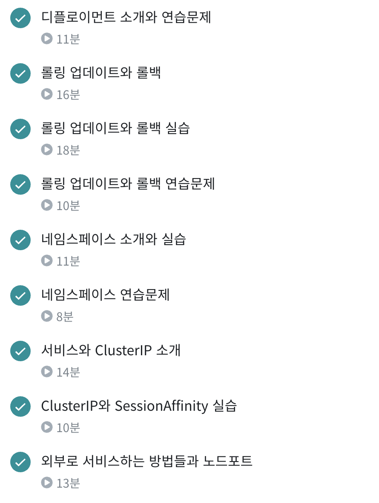

## 목표

#### Leetcode

**[Number of Ways Where Square of Number Is Equal to Product of Two Numbers](https://leetcode.com/problems/number-of-ways-where-square-of-number-is-equal-to-product-of-two-numbers/)**

```kotlin
class Solution {
    fun numTriplets(nums1: IntArray, nums2: IntArray): Int {
        var result = 0
        for (num in nums1) {
            result += getTriplets(num.toLong() * num, nums2)
        }
        for (num in nums2) {
            result += getTriplets(num.toLong() * num, nums1)
        }
        return result
    }

    private fun getTriplets(targetNum: Long, nums: IntArray): Int {
        val map = mutableMapOf<Long, Int>()
        var result = 0
        nums.filter { targetNum % it == 0L }.forEach { 
            result += map.getOrDefault(it.toLong(), 0)
            map[targetNum/it] = map.getOrDefault(targetNum/it, 0) + 1
        }
        return result
    }
}
```


**[Replace All ?'s to Avoid Consecutive Repeating Characters](https://leetcode.com/problems/replace-all-s-to-avoid-consecutive-repeating-characters/)**

```kotlin
class Solution {
    fun modifyString(s: String): String {
        val resultArr = s.toCharArray()
        val length = s.length

        val arr = CharArray(26) { i -> 'a' + i }
        var index = 0
        for (i in 0 until length) {
            if (resultArr[i] != '?') {
                continue
            }
            val prevChar = if (i == 0) '1' else resultArr[i-1]
            val nextChar = if (i == length-1) '1' else resultArr[i+1]
            do {
                resultArr[i] = arr[index++ % 26]
            } while (prevChar == resultArr[i] || nextChar == resultArr[i])
        }
        
        return String(resultArr)
    }
}
```


#### 쿠버네티스 강좌 듣기



